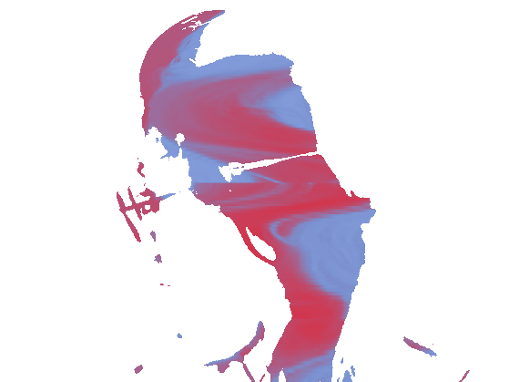

# In Between Temperatures
WCC2 – Sketch 04  
Author: Haiyi Xiao  
Date: Mar 2026  

## Short Description
A TouchDesigner sketch that uses frame differencing to reveal a shifting hidden layer beneath a white surface through body movement.

## Concept / Intent
This project was developed as a sketchbook experiment exploring computer vision, visual masking, and hidden-layer imagery in TouchDesigner. The work developed from an initial idea of tearing open a white surface, and eventually became an exploration of hidden chaos beneath a person’s outward appearance.

## Tools / Techniques
- TouchDesigner
- Webcam input
- Frame differencing
- Threshold / blur
- Texture3D
- Time Machine
- Colour transformation

## How It Works
The webcam captures live video input. Frame differencing compares the current frame with the previous frame and extracts the regions of visual change. These changing areas act as a mask that reveals a hidden animated layer beneath the white surface. The hidden layer is created through abstract textures and shifting colours, producing the effect of an unstable inner space appearing through movement.

## How to Run
1. Open the `.toe` file in TouchDesigner.
2. Make sure a webcam is connected and selected correctly.
3. Stand or move in front of the camera.
4. The visual effect appears through movement detected by frame differencing.

## Requirements
- TouchDesigner
- Webcam
- A stable lighting environment is recommended for clearer detection

## Screenshots / Media

## Credits / Acknowledgements
Created by Haiyi Xiao.

Inspired by:
- **ComputerVision_FrameDifferencing_2025_32280** by Becky Aston (from WCC2 Week 8 examples)
- **CFP-video-and-slitscans** by Luke Demarest (from CFP Week 3 examples)

## License
This project is shared for educational and non-commercial purposes.

## Contact / Links
- GitHub Repository: https://github.com/XamnerX/In-Between-Temperatures